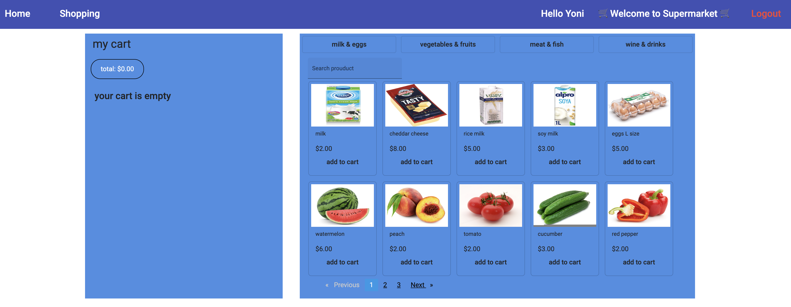

# Project Title

Best online supermarket

## Description

Online supermarket! The best store for buying household goods. Simple and convenient interface.

Technologies in this project: Angular, Node.JS, MySQL, Docker.

## Images

 

<!--  -->


## Getting Started

### Dependencies

* NodeJS, Docker

### Installing

git clone my reposetory to your local folder.

### Executing program

* open the terminal and run the following commands:
```
cd dev-apps
docker compose up
```
* open new terminal and run the following commands:
```
cd apps\server
npm install
npm run all-slim
```
* open new terminal and run the following commands:
```
cd apps\client
npm install
npm start
```

## Help

If you running into a docker problem, check if the port 3306 of MySQL is available,
```
docker compose down 
```
after you make sure the port is available, run the following command in the dev-apps folder: 
```
docker compose up 
```
